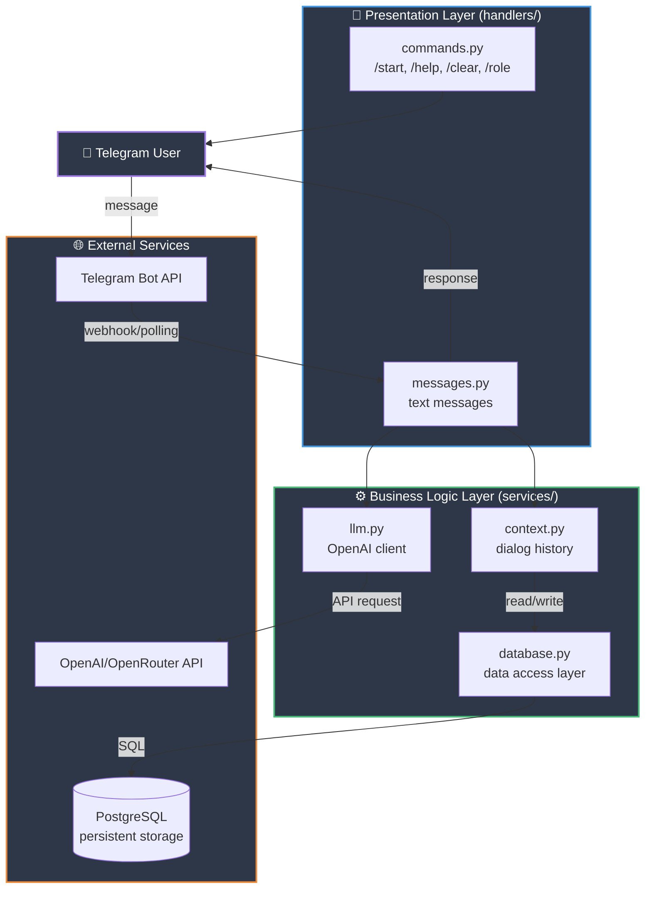
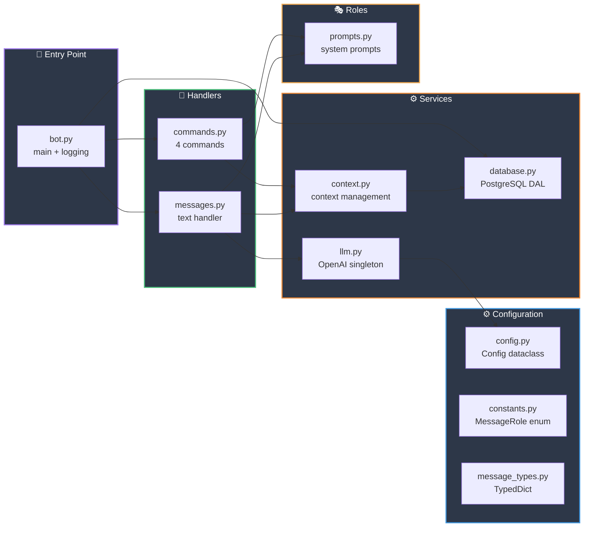

# Архитектура

**Цель:** Понять как устроена система на высоком уровне.

---

## Общая архитектура

Проект построен по **трёхслойной архитектуре**:



---

## Основной поток обработки сообщения

```mermaid
sequenceDiagram
    participant U as 👤 User
    participant H as handlers/messages.py
    participant C as services/context.py
    participant D as services/database.py
    participant DB as PostgreSQL
    participant L as services/llm.py
    participant API as OpenAI API

    U->>H: "Привет!"
    H->>C: get_context(user_id, chat_id)
    C->>D: get_messages(user_id, chat_id)
    D->>DB: SELECT * FROM messages...
    DB-->>D: rows
    D-->>C: messages
    C-->>H: {messages: [...]}

    Note over H: Добавить сообщение<br/>в контекст

    H->>C: trim_context(messages, max=10)
    C-->>H: trimmed messages

    H->>L: get_llm_response(messages, config)
    L->>API: chat.completions.create()
    API-->>L: "Привет! Чем могу помочь?"
    L-->>H: response

    H->>C: save_context(user_id, chat_id, messages)
    C->>D: save_message(user_id, chat_id, ...)
    D->>DB: INSERT INTO messages...
    DB-->>D: ok
    D-->>C: message_id
    C-->>H: ok

    H->>U: "Привет! Чем могу помочь?"

    style U fill:#2d3748,stroke:#9f7aea,stroke-width:2px,color:#fff
    style H fill:#2d3748,stroke:#4299e1,stroke-width:2px,color:#fff
    style C fill:#2d3748,stroke:#48bb78,stroke-width:2px,color:#fff
    style D fill:#2d3748,stroke:#48bb78,stroke-width:2px,color:#fff
    style DB fill:#2d3748,stroke:#ed8936,stroke-width:2px,color:#fff
    style L fill:#2d3748,stroke:#48bb78,stroke-width:2px,color:#fff
    style API fill:#2d3748,stroke:#ed8936,stroke-width:2px,color:#fff
```

---

## Структура модулей



---

## Ключевые компоненты

### 1. bot.py — Точка входа

```python
async def main() -> None:
    """Главная функция запуска бота"""
    config = load_config()           # Загрузка из .env
    bot = Bot(token=config.telegram_token)
    dp = Dispatcher()

    dp.include_router(commands.router)   # Регистрация handlers
    dp.include_router(messages.router)

    await init_db()                  # Инициализация БД
    try:
        await dp.start_polling(bot)  # Long polling
    finally:
        await close_db()             # Закрытие БД
```

**Задачи:**
- Инициализация aiogram (Bot + Dispatcher)
- Регистрация роутеров (handlers)
- Настройка логирования
- Инициализация пула соединений с PostgreSQL
- Запуск long polling
- Корректное закрытие БД при остановке

---

### 2. handlers/ — Presentation Layer

#### commands.py
Обрабатывает команды:
- `/start` — приветствие с персонализацией
- `/help` — справка по командам
- `/clear` — очистка контекста диалога
- `/role` — информация о роли бота

#### messages.py
Обрабатывает текстовые сообщения:
1. Получает контекст из `context.py`
2. Добавляет сообщение пользователя
3. Усекает контекст до 10 сообщений
4. Запрашивает ответ от LLM через `llm.py`
5. Сохраняет обновлённый контекст
6. Отправляет ответ пользователю

---

### 3. services/ — Business Logic Layer

#### context.py
**Управление контекстом диалогов:**
- `get_context()` — получить контекст пользователя из БД
- `save_context()` — сохранить контекст в БД
- `clear_context()` — выполнить soft delete сообщений
- `trim_context()` — усечь до max сообщений (сохраняя system prompt)

**Хранение:** PostgreSQL через `database.py`, персистентно между перезапусками.

#### database.py
**Слой доступа к данным (DAL):**
- `init_db()` / `close_db()` — управление пулом соединений
- `get_or_create_user()` — получить/создать пользователя
- `get_or_create_chat()` — получить/создать чат
- `save_message()` — сохранить сообщение (с автоматическим `length` и `created_at`)
- `get_messages()` — получить историю сообщений (исключая удалённые)
- `soft_delete_messages()` — пометить сообщения как удалённые

**Технологии:** Raw SQL через `psycopg3` (асинхронный драйвер), connection pool.

#### llm.py
**Работа с OpenAI API:**
- `_get_or_create_client()` — Singleton pattern для клиента OpenAI
- `get_llm_response()` — получить ответ от LLM
- Обработка всех типов ошибок API (timeout, rate limit, connection)
- Очистка markdown и служебных токенов из ответа

**Особенности:**
- Кэширование клиента для переиспользования
- Graceful degradation (понятные сообщения об ошибках)
- Очистка форматирования (**, *, _, `)

---

### 4. roles/ — System Prompts

#### prompts.py
- `DEFAULT_SYSTEM_PROMPT` — базовый промпт для AI
- `ROLE_INFO` — информация о роли "Daily Reporter"
- `get_system_prompt()` — промпт с персонализацией (добавляет имя пользователя)

**Роль бота:** Полезный AI-ассистент, работает без markdown форматирования.

---

### 5. config.py — Configuration

```python
@dataclass
class Config:
    telegram_token: str              # Обязательно
    openai_api_key: str              # Обязательно
    openai_base_url: str = "..."    # Опционально
    openai_model: str = "..."        # Опционально
    max_tokens: int = 1000
    temperature: float = 0.7
    max_context_messages: int = 10
    openai_timeout: int = 30
```

Загружается из `.env` файла через `python-dotenv`.

---

## Принципы архитектуры

### KISS (Keep It Simple, Stupid)
- Простые решения вместо сложных паттернов
- Нет DI-контейнеров, нет абстрактных фабрик
- Прямые вызовы функций

### YAGNI (You Aren't Gonna Need It)
- Только необходимый функционал
- Нет базы данных (in-memory достаточно для MVP)
- Нет retry-логики, нет rate limiting

### Fail Fast
- Валидация конфигурации при старте
- Явные ошибки лучше скрытых багов
- Graceful degradation для внешних API

---

## Ограничения текущей архитектуры

| Ограничение | Причина | Подходит для |
|-------------|---------|--------------|
| In-memory хранение | MVP, простота | Локальное использование |
| Нет персистентности | Контекст теряется при рестарте | Демо, разработка |
| Long polling | Нет webhook setup | Простое развёртывание |
| Нет retry-логики | YAGNI для MVP | Стабильные API |
| Один бот на процесс | Нет горизонтального масштабирования | Малая нагрузка |

**Вывод:** Архитектура подходит для учебного MVP и локального использования. Для production потребуется БД и webhook.

---

## Следующие шаги

- 📊 [Модель данных](03-DATA_MODEL.md) — структуры данных в деталях
- 🛠️ [Разработка](04-DEVELOPMENT.md) — как вносить изменения

---

**Ключевые решения задокументированы в:**
- [ADR-01](../adrs/ADR-01.md) — Выбор OpenAI
- [ADR-02](../adrs/ADR-02.md) — Выбор aiogram

