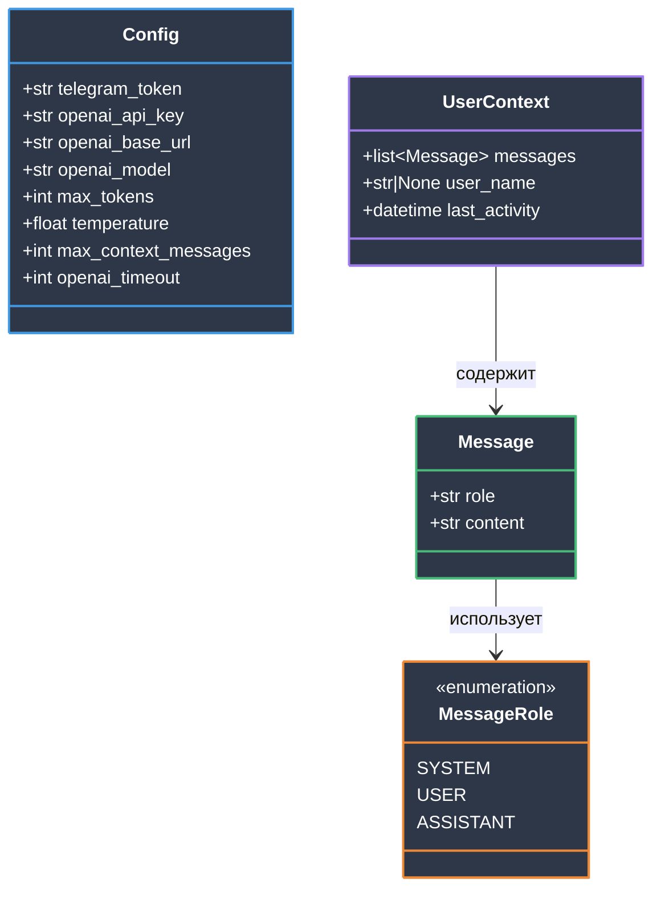
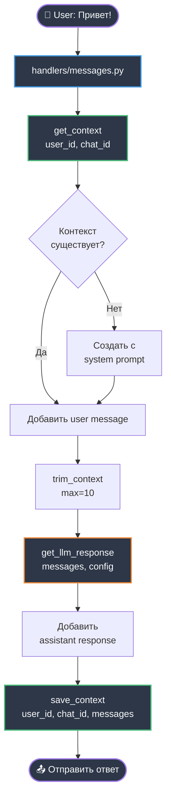
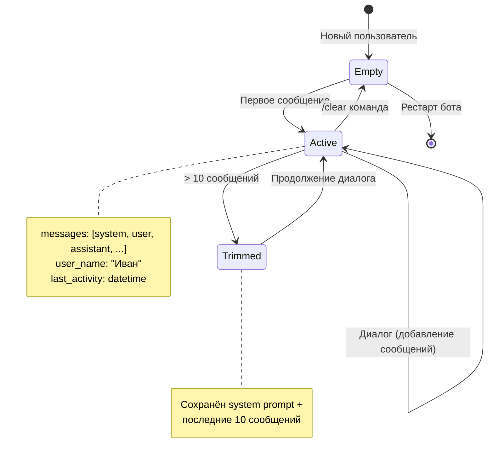

# Модель данных

**Цель:** Понять все структуры данных в системе.

---

## Обзор



---

## 1. Message — Сообщение в диалоге

**Файл:** `message_types.py`

```python
from typing import TypedDict

class Message(TypedDict):
    """Сообщение в диалоге"""
    role: str         # "system" | "user" | "assistant"
    content: str      # Текст сообщения
```

### Пример использования

```python
# System prompt
system_msg = {
    "role": MessageRole.SYSTEM,
    "content": "Ты — полезный AI-ассистент."
}

# Сообщение пользователя
user_msg = {
    "role": MessageRole.USER,
    "content": "Привет!"
}

# Ответ ассистента
assistant_msg = {
    "role": MessageRole.ASSISTANT,
    "content": "Здравствуйте! Чем могу помочь?"
}
```

### Формат для OpenAI API

Структура `Message` соответствует формату OpenAI Chat Completions API:

```json
{
  "role": "user",
  "content": "Привет!"
}
```

---

## 2. MessageRole — Роли сообщений

**Файл:** `constants.py`

```python
from enum import Enum

class MessageRole(str, Enum):
    """Роли сообщений в диалоге"""
    SYSTEM = "system"      # Системный промпт
    USER = "user"          # Сообщение пользователя
    ASSISTANT = "assistant"  # Ответ ассистента
```

### Почему Enum?

✅ **Безопасность типов** — mypy проверяет корректность
✅ **Автодополнение** — IDE подсказывает варианты
✅ **Нет magic strings** — `MessageRole.USER` вместо `"user"`
❌ **До рефакторинга:** Были строки `"system"`, `"user"` — риск опечаток

---

## 3. UserContext — Контекст пользователя

**Файл:** `services/context.py`

```python
# Структура контекста (не TypedDict в коде, но логическая структура)
{
    "messages": [Message, ...],      # История диалога
    "user_name": str | None,         # Имя пользователя
    "last_activity": datetime        # Время последней активности
}
```

### Хранение

```python
# Глобальный словарь в services/context.py
user_contexts: dict[tuple[int, int], dict] = {}

# Ключ: (user_id, chat_id)
# Значение: словарь с контекстом
```

**Пример:**

```python
user_contexts[(123456, 789012)] = {
    "messages": [
        {"role": "system", "content": "Ты — AI-ассистент..."},
        {"role": "user", "content": "Привет!"},
        {"role": "assistant", "content": "Здравствуйте!"}
    ],
    "user_name": "Иван",
    "last_activity": datetime(2025, 10, 16, 14, 30)
}
```

### Операции с контекстом

```python
# Получить контекст
context = get_context(user_id, chat_id)
# → {"messages": [...], "user_name": None, ...}

# Сохранить контекст
save_context(user_id, chat_id, messages, user_name)

# Очистить контекст
clear_context(user_id, chat_id)

# Усечь контекст до max сообщений
messages = trim_context(messages, max_messages=10)
```

---

## 4. Config — Конфигурация приложения

**Файл:** `config.py`

```python
from dataclasses import dataclass

@dataclass
class Config:
    """Конфигурация приложения"""

    # Обязательные параметры
    telegram_token: str         # Токен Telegram бота
    openai_api_key: str         # API ключ для LLM

    # Опциональные параметры (с дефолтами)
    openai_base_url: str = "https://api.openai.com/v1"
    openai_model: str = "openai/gpt-oss-20b:free"
    max_tokens: int = 1000
    temperature: float = 0.7
    max_context_messages: int = 10
    openai_timeout: int = 30
```

### Загрузка из .env

```python
from config import load_config

config = load_config()  # Читает .env файл

# Валидация при загрузке
# ❌ Если нет TELEGRAM_TOKEN → ValueError
# ❌ Если нет OPENAI_API_KEY → ValueError
```

### Параметры

| Параметр | Тип | Дефолт | Описание |
|----------|-----|--------|----------|
| `telegram_token` | str | — | Токен от @BotFather |
| `openai_api_key` | str | — | API ключ для LLM |
| `openai_base_url` | str | OpenAI URL | URL API (для OpenRouter и др.) |
| `openai_model` | str | gpt-oss-20b:free | Модель LLM |
| `max_tokens` | int | 1000 | Макс. токенов в ответе |
| `temperature` | float | 0.7 | Креативность (0.0-1.0) |
| `max_context_messages` | int | 10 | Макс. сообщений в контексте |
| `openai_timeout` | int | 30 | Таймаут запроса (секунды) |

---

## 5. Поток данных



---

## 6. Пример полного контекста

```python
# После нескольких сообщений
user_contexts[(123456, 789012)] = {
    "messages": [
        # System prompt (всегда первый)
        {
            "role": "system",
            "content": "Ты — полезный AI-ассистент.\n\nИмя пользователя: Иван"
        },

        # Диалог
        {"role": "user", "content": "Привет!"},
        {"role": "assistant", "content": "Здравствуйте, Иван! Чем могу помочь?"},

        {"role": "user", "content": "Столица России?"},
        {"role": "assistant", "content": "Москва."},

        {"role": "user", "content": "А население?"},
        {"role": "assistant", "content": "Около 13 миллионов человек."}
    ],
    "user_name": "Иван",
    "last_activity": datetime(2025, 10, 16, 14, 35, 12)
}
```

---

## 7. Ограничения и правила

### Trim Context

```python
def trim_context(messages: list[Message], max_messages: int = 10) -> list[Message]:
    """
    Усекает контекст до max_messages.
    ВСЕГДА сохраняет system prompt (первое сообщение).
    """
```

**Логика:**
- Если `len(messages) <= max_messages + 1` → возврат как есть
- Если больше → `[system_prompt] + последние max_messages`

**Пример:**
```python
# 25 сообщений в контексте, max=10
# Результат: 11 сообщений
# [system] + [последние 10 сообщений диалога]
```

### Персонализация

```python
def get_system_prompt(user_name: str | None = None) -> str:
    """Добавляет имя пользователя в system prompt"""
    if user_name:
        return DEFAULT_SYSTEM_PROMPT + f"\n\nИмя пользователя: {user_name}"
    return DEFAULT_SYSTEM_PROMPT
```

---

## 8. Жизненный цикл контекста



---

## Итого

| Структура | Назначение | Хранение |
|-----------|-----------|----------|
| `Message` | Одно сообщение в диалоге | TypedDict |
| `MessageRole` | Роли сообщений (enum) | Константа |
| `UserContext` | Контекст пользователя | In-memory dict |
| `Config` | Конфигурация приложения | Dataclass из .env |

**Все структуры простые, без сложных паттернов.**

---

## Следующие шаги

- 🛠️ [Разработка](04-DEVELOPMENT.md) — как работать с этими структурами
- 📐 [Архитектура](02-ARCHITECTURE.md) — как структуры используются в системе


