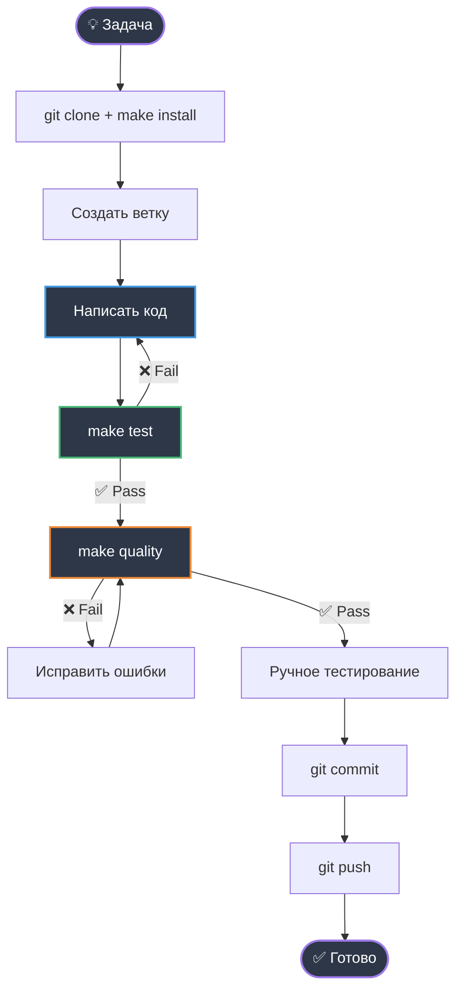
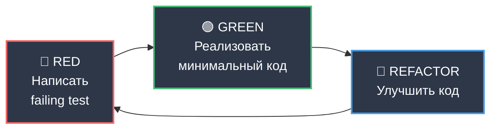

# Разработка

**Цель:** Как вносить изменения в проект правильно.

---

## Workflow разработки



---

## Команды для разработки

### Установка и запуск

```bash
# Первая установка
make install        # uv venv + sync + создать .env

# Запуск бота
make run            # uv run bot.py

# Очистка
make clean          # Удалить __pycache__, логи, coverage
```

### Проверка качества

```bash
# Тестирование
make test           # Запустить все тесты (pytest)
make coverage       # Тесты + отчёт о покрытии (HTML)

# Качество кода
make format         # Автоформатирование (ruff format)
make lint           # Проверка стиля (ruff check)
make typecheck      # Проверка типов (mypy)

# Всё вместе
make quality        # format + lint + typecheck + test
```

**Правило:** Перед коммитом всегда `make quality` должен проходить без ошибок.

---

## Проверки качества

### 1. Форматирование (ruff format)

**Цель:** Единообразный стиль кода

```bash
make format
```

**Автоматически исправляет:**
- Отступы (4 пробела)
- Длина строки (max 100 символов)
- Пустые строки
- Trailing whitespace

**Настройки:** `pyproject.toml`
```toml
[tool.ruff]
line-length = 100
target-version = "py311"
```

---

### 2. Линтинг (ruff check)

**Цель:** Найти потенциальные проблемы

```bash
make lint
```

**Проверяет:**
- `E, W` — PEP 8 ошибки и предупреждения
- `F` — Pyflakes (неиспользуемые импорты, переменные)
- `I` — isort (порядок импортов)
- `B` — flake8-bugbear (потенциальные баги)
- `C4` — flake8-comprehensions (оптимизация comprehensions)
- `UP` — pyupgrade (современный Python синтаксис)

**Настройки:** `pyproject.toml`
```toml
[tool.ruff.lint]
select = ["E", "W", "F", "I", "B", "C4", "UP"]
ignore = ["E501"]  # line too long (ruff format handles this)
```

---

### 3. Проверка типов (mypy)

**Цель:** Статический анализ типов

```bash
make typecheck
```

**Требования:**
- ✅ Type hints для всех публичных функций
- ✅ `-> None` для функций без возврата
- ✅ `str | None` для nullable (Python 3.11+)
- ✅ Guard clauses для nullable полей

**Пример:**

```python
# ✅ Правильно
async def cmd_start(message: Message) -> None:
    if not message.from_user:
        return

    user_name = message.from_user.first_name
    # ...

# ❌ Неправильно (mypy ошибка)
async def cmd_start(message: Message):  # Нет -> None
    user_name = message.from_user.first_name  # Может быть None
```

**Настройки:** `pyproject.toml`
```toml
[tool.mypy]
python_version = "3.11"
warn_return_any = true
warn_unused_configs = true
disallow_untyped_defs = true
exclude = ["tests/"]
```

---

### 4. Тестирование (pytest)

**Цель:** Проверить корректность кода

```bash
make test           # Быстрые тесты
make coverage       # С отчётом покрытия
```

**Структура тестов:**

```
tests/
  test_commands.py      # Тесты команд (10 тестов)
  test_context.py       # Тесты контекста (13 тестов)
  test_llm.py          # Тесты LLM (9 тестов)
  test_prompts.py      # Тесты промптов (7 тестов)
  test_config.py       # Тесты конфигурации (8 тестов)
  test_handlers.py     # Интеграционные (11 тестов)
```

**Всего:** 58 тестов, Coverage: 85%+

---

## Как писать тесты

### Структура теста

```python
import pytest
from unittest.mock import AsyncMock

@pytest.mark.asyncio
async def test_function_name():
    """Описание что тестируем"""
    # Arrange (подготовка)
    mock_obj = AsyncMock()

    # Act (действие)
    result = await some_function(mock_obj)

    # Assert (проверка)
    assert result == expected
    mock_obj.method.assert_called_once()
```

### Фикстуры

```python
@pytest.fixture
def mock_message():
    """Мок Telegram Message"""
    message = AsyncMock()
    message.from_user.id = 123456
    message.from_user.first_name = "Test"
    message.chat.id = 789012
    return message
```

### Parametrized тесты

```python
@pytest.mark.parametrize("input_len,max_messages,expected_len", [
    (5, 10, 5),      # меньше лимита
    (11, 10, 11),    # ровно лимит
    (25, 10, 11),    # больше лимита
])
def test_trim_context_parametrized(input_len, max_messages, expected_len):
    messages = [{"role": "system", "content": "System"}]
    messages += [{"role": "user", "content": f"msg{i}"} for i in range(input_len - 1)]

    result = trim_context(messages, max_messages)

    assert len(result) == expected_len
```

### Мокирование OpenAI

```python
@pytest.mark.asyncio
async def test_llm_response_success(mock_config):
    mock_response = AsyncMock()
    mock_response.choices = [
        AsyncMock(message=AsyncMock(content="Test response"))
    ]

    with patch("services.llm.AsyncOpenAI") as mock_client_cls:
        mock_client = AsyncMock()
        mock_client.chat.completions.create.return_value = mock_response
        mock_client_cls.return_value = mock_client

        result = await get_llm_response([...], mock_config)

        assert result == "Test response"
```

---

## Соглашения о коде

### 1. Именование

```python
# Модули: snake_case
handlers/commands.py
services/llm.py

# Классы: PascalCase
class Config:
class MessageRole:

# Функции и переменные: snake_case
def get_context():
user_id = 123

# Константы: UPPER_CASE
DEFAULT_SYSTEM_PROMPT = "..."
MAX_CONTEXT_MESSAGES = 10

# Приватные: _prefix
_client_cache = {}
def _get_or_create_client():
```

### 2. Docstrings (Google Style)

```python
def trim_context(messages: list[Message], max_messages: int = 10) -> list[Message]:
    """Усечь контекст до максимального количества сообщений.

    Всегда сохраняет system prompt (первое сообщение).

    Args:
        messages: Список сообщений в формате OpenAI
        max_messages: Максимальное количество сообщений (не считая system)

    Returns:
        Усеченный список сообщений с сохранением system prompt

    Example:
        >>> msgs = [{"role": "system", ...}, {"role": "user", ...}, ...]
        >>> trim_context(msgs, max_messages=5)
        [system_msg, last_5_msgs]
    """
```

### 3. Использование Enum

```python
# ❌ Не используй magic strings
if message["role"] == "system":

# ✅ Используй Enum
from constants import MessageRole

if message["role"] == MessageRole.SYSTEM:
```

### 4. Type Hints

```python
# ✅ Современный синтаксис Python 3.11+
def get_context(user_id: int, chat_id: int) -> dict:
def save_context(messages: list[Message], user_name: str | None = None) -> None:

# ❌ Старый синтаксис (не используй)
from typing import Optional, List
def save_context(messages: List[Message], user_name: Optional[str] = None) -> None:
```

### 5. Обработка ошибок

```python
# ✅ Специфичные исключения
try:
    response = await client.chat.completions.create(...)
except RateLimitError:
    return "⚠️ Слишком много запросов."
except APITimeoutError:
    return "⏱️ Превышено время ожидания."
except APIConnectionError:
    return "❌ Не удалось подключиться."
except Exception as e:
    logger.error(f"Unexpected error: {e}")
    return "❌ Произошла ошибка."

# ❌ Общий except без логирования
try:
    ...
except:
    pass
```

---

## TDD (Test-Driven Development)

Проект использует TDD для новых функций. Пример: команда `/role` (итерация 8).

### Цикл TDD



### Пример: Добавление новой команды

**1. RED — Написать тест**

```python
# tests/test_commands.py
@pytest.mark.asyncio
async def test_cmd_new_command(mock_message):
    """Тест новой команды"""
    await cmd_new_command(mock_message)

    mock_message.answer.assert_called_once()
    call_args = mock_message.answer.call_args[0][0]
    assert "ожидаемый текст" in call_args
```

Запустить: `pytest tests/test_commands.py::test_cmd_new_command -v`
Ожидаемо: ❌ ImportError или AssertionError

**2. GREEN — Реализовать**

```python
# handlers/commands.py
@router.message(Command("newcommand"))
async def cmd_new_command(message: Message) -> None:
    """Обработчик команды /newcommand"""
    if not message.from_user:
        return

    await message.answer("ожидаемый текст")
```

Запустить: `pytest tests/test_commands.py::test_cmd_new_command -v`
Ожидаемо: ✅ PASSED

**3. REFACTOR — Улучшить**

- Добавить логирование
- Обновить `/help`
- Проверить все тесты: `make test`
- Проверить качество: `make quality`

---

## Логирование

### Настройка

Логирование настроено в `bot.py`:

```python
logging.basicConfig(
    level=logging.INFO,
    format="%(asctime)s - %(name)s - %(levelname)s - %(message)s",
    handlers=[
        logging.FileHandler("bot.log", encoding="utf-8"),
        logging.StreamHandler()
    ]
)
```

### Использование

```python
import logging

logger = logging.getLogger(__name__)

# INFO — важные события
logger.info(f"User {user_id} started conversation")

# ERROR — ошибки
logger.error(f"LLM error: {e}")

# WARNING — предупреждения
logger.warning("Empty response from LLM")
```

### Просмотр логов

```bash
# В реальном времени
tail -f bot.log

# Фильтрация ошибок
grep "ERROR" bot.log

# Подсчёт запросов
grep "LLM request" bot.log | wc -l
```

---

## Процесс коммита

### 1. Проверка перед коммитом

```bash
# Обязательная проверка
make quality

# Всё должно пройти:
# ✅ Форматирование
# ✅ Линтинг (0 ошибок)
# ✅ Типизация (0 ошибок mypy)
# ✅ Тесты (100% passed)
```

### 2. Формат коммита

```bash
# Структура: <type>(<scope>): <description>

git commit -m "feat(commands): добавить команду /role"
git commit -m "fix(llm): исправить очистку markdown"
git commit -m "test(context): добавить parametrized тесты"
git commit -m "refactor(config): убрать глобальную загрузку"
git commit -m "docs(guides): добавить DEVELOPMENT.md"
```

**Types:**
- `feat` — новая функция
- `fix` — исправление бага
- `test` — добавление тестов
- `refactor` — рефакторинг без изменения поведения
- `docs` — обновление документации
- `chore` — инфраструктурные изменения

---

## Ручное тестирование

После `make quality` проверьте бота вручную:

```
✅ /start       → Приветствие с именем
✅ Привет!      → Ответ от AI
✅ Как дела?    → Ответ с учётом контекста
✅ (10+ сообщений) → Контекст усекается корректно
✅ /clear       → История очищена
✅ Новое сообщение → Новый контекст
✅ /help        → Список команд
✅ /role        → Информация о роли
```

---

## Troubleshooting

### Тесты падают после изменений

```bash
# 1. Проверить конкретный тест
pytest tests/test_module.py::test_name -v

# 2. Показать полный traceback
pytest tests/ -vv

# 3. Остановиться на первой ошибке
pytest tests/ -x
```

### mypy показывает ошибки

```bash
# Проверить конкретный файл
mypy handlers/commands.py

# Показать все ошибки с контекстом
mypy bot.py handlers/ services/ roles/ config.py --show-error-codes
```

### Coverage слишком низкий

```bash
# Запустить с отчётом
make coverage

# Открыть HTML отчёт
# Windows: start htmlcov/index.html
# Linux/Mac: open htmlcov/index.html

# Найти непокрытые строки
pytest --cov=. --cov-report=term-missing
```

---

## Итого

**Процесс разработки:**
1. Клонировать и настроить (`make install`)
2. Написать тест (RED)
3. Реализовать функцию (GREEN)
4. Улучшить код (REFACTOR)
5. Проверить качество (`make quality`)
6. Ручное тестирование
7. Коммит и push

**Ключевые команды:**
- `make quality` — проверка перед коммитом
- `make test` — быстрые тесты
- `make coverage` — с отчётом покрытия

**Принципы:**
- KISS — простота важнее сложности
- TDD — тесты перед кодом
- Type safety — типы везде
- Fail fast — явные ошибки

---

## Связанные документы

- 📐 [Архитектура](02-ARCHITECTURE.md) — структура системы
- 📊 [Модель данных](03-DATA_MODEL.md) — работа с данными
- 📚 [vision.md](../vision.md) — техническое видение
- 📝 [tasklist.md](../tasklist.md) — история разработки


