# Визуальный гайд

**Цель:** Понять проект через визуализацию с разных точек зрения.

---

## 1. 🏗️ Системная архитектура

### Трёхслойная архитектура

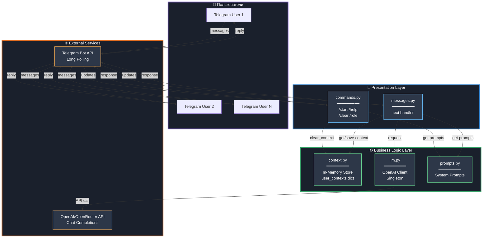

---

## 2. 💬 Поток обработки сообщения

### Полный lifecycle от пользователя до ответа

```mermaid
sequenceDiagram
    autonumber

    actor User as 👤 Пользователь
    participant TG as 🤖 Telegram Bot
    participant Handler as handlers/messages
    participant Context as services/context
    participant Prompts as roles/prompts
    participant LLM as services/llm
    participant OpenAI as ☁️ OpenAI API

    rect rgb(26, 32, 44)
    Note over User,OpenAI: Начало диалога
    User->>TG: "Привет!"
    TG->>Handler: Message(text="Привет!")
    end

    rect rgb(26, 32, 44)
    Note over Handler,Context: Получение контекста
    Handler->>Context: get_context(user_id, chat_id)
    Context-->>Handler: {messages: [], user_name: None}
    end

    rect rgb(26, 32, 44)
    Note over Handler,Prompts: Инициализация контекста
    Handler->>Prompts: get_system_prompt(user_name)
    Prompts-->>Handler: "Ты — AI-ассистент..."
    Handler->>Handler: Добавить system prompt
    Handler->>Handler: Добавить user message
    end

    rect rgb(26, 32, 44)
    Note over Handler,Context: Усечение контекста
    Handler->>Context: trim_context(messages, max=10)
    Context-->>Handler: trimmed messages
    end

    rect rgb(26, 32, 44)
    Note over Handler,OpenAI: Запрос к LLM
    Handler->>TG: send_chat_action("typing")
    Handler->>LLM: get_llm_response(messages, config)
    LLM->>OpenAI: chat.completions.create()
    OpenAI-->>LLM: "Привет! Чем могу помочь?"
    LLM-->>Handler: response
    end

    rect rgb(26, 32, 44)
    Note over Handler,Context: Сохранение результата
    Handler->>Handler: Добавить assistant response
    Handler->>Context: save_context(user_id, chat_id, messages)
    Context->>Context: user_contexts[(id, chat)] = {...}
    end

    rect rgb(26, 32, 44)
    Note over Handler,User: Отправка ответа
    Handler->>TG: answer("Привет! Чем могу помочь?")
    TG->>User: "Привет! Чем могу помочь?"
    end

    Note over User,OpenAI: Диалог продолжается...
```

---

## 3. 🗂️ Структура проекта

### Файловая организация

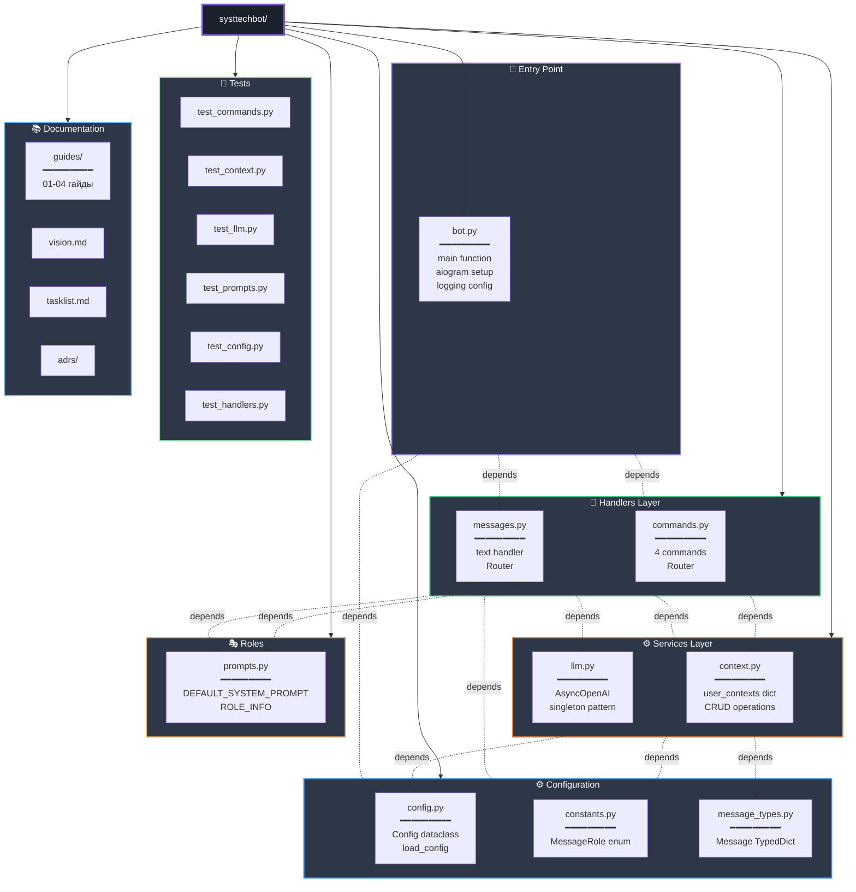

---

## 4. 🔄 Жизненный цикл контекста

### State diagram контекста диалога

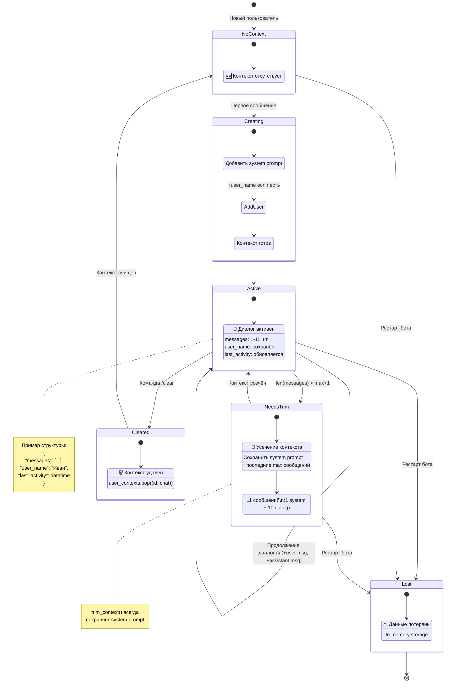

---

## 5. 📊 Модель данных

### Class diagram со связями

```mermaid
classDiagram
    class Config {
        +string telegram_token ⚠️
        +string openai_api_key ⚠️
        +string openai_base_url
        +string openai_model
        +int max_tokens
        +float temperature
        +int max_context_messages
        +int openai_timeout
        +load_config() Config
    }

    class MessageRole {
        <<enumeration>>
        +SYSTEM = "system"
        +USER = "user"
        +ASSISTANT = "assistant"
    }

    class Message {
        <<TypedDict>>
        +string role
        +string content
    }

    class UserContext {
        +list~Message~ messages
        +string|null user_name
        +datetime last_activity
    }

    class ContextManager {
        +dict user_contexts
        +get_context(user_id, chat_id) dict
        +save_context(user_id, chat_id, messages, user_name) void
        +clear_context(user_id, chat_id) void
        +trim_context(messages, max_messages) list
    }

    class LLMService {
        -dict _client_cache
        -_get_or_create_client(config) AsyncOpenAI
        +get_llm_response(messages, config) string
    }

    class CommandHandler {
        +router Router
        +cmd_start(message) void
        +cmd_help(message) void
        +cmd_clear(message) void
        +cmd_role(message) void
    }

    class MessageHandler {
        +router Router
        +handle_message(message) void
    }

    class PromptsService {
        +DEFAULT_SYSTEM_PROMPT string
        +ROLE_INFO string
        +get_system_prompt(user_name) string
    }

    Message --> MessageRole: использует
    UserContext o-- Message: содержит много
    ContextManager --> UserContext: управляет
    LLMService --> Config: использует
    LLMService --> Message: обрабатывает
    MessageHandler --> ContextManager: вызывает
    MessageHandler --> LLMService: вызывает
    MessageHandler --> PromptsService: использует
    CommandHandler --> ContextManager: вызывает
    CommandHandler --> PromptsService: использует

    note for Config "⚠️ Обязательные параметры\nиз .env файла"
    note for Message "Формат OpenAI API\nChat Completions"
    note for UserContext "In-memory хранение\nключ: (user_id, chat_id)"
    note for LLMService "Singleton pattern\nдля OpenAI клиента"
```

---

## 6. 🔁 Developer Workflow

### Процесс разработки с TDD

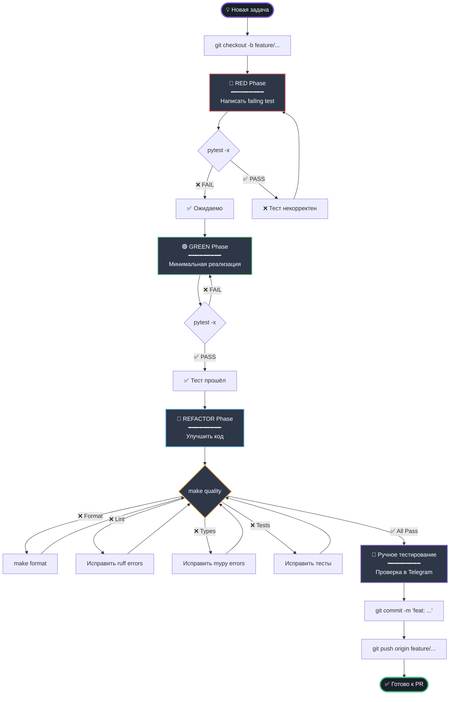

---

## 7. ⚡ Обработка команд vs сообщений

### Маршрутизация в aiogram

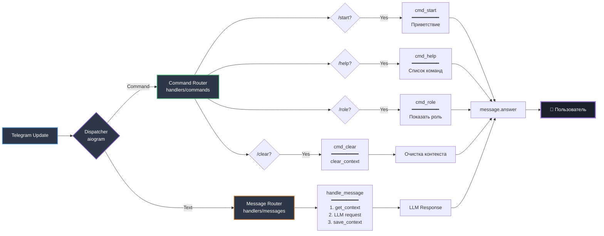

---

## 8. 🧪 Тестовая архитектура

### Покрытие тестами

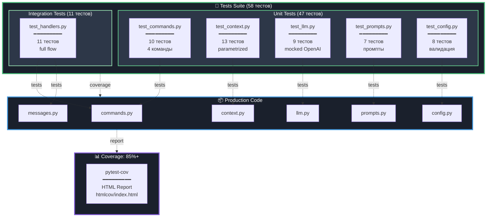

---

## 9. 🔐 Конфигурация и секреты

### Environment Variables Flow

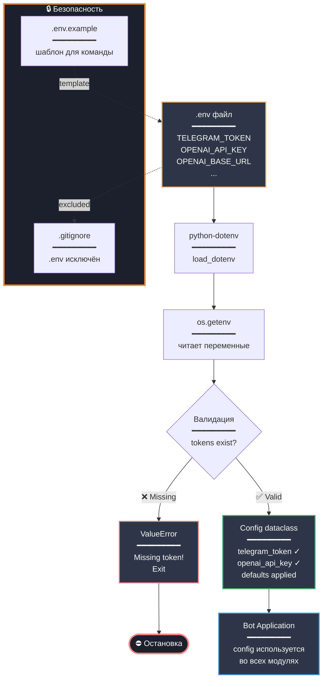

---

## 10. 🚀 Deployment View

### Текущая архитектура развёртывания

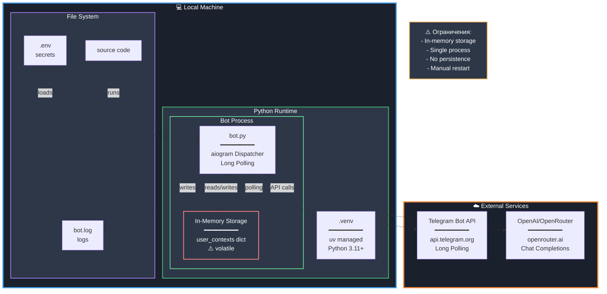

---

## 11. ⚙️ Quality Checks Pipeline

### make quality workflow

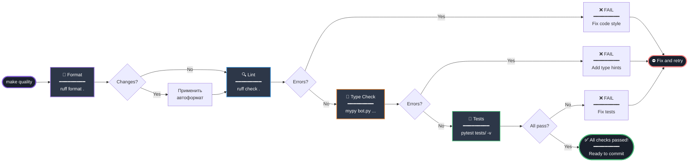

---

## 12. 📈 User Journey

### Типичный сценарий использования

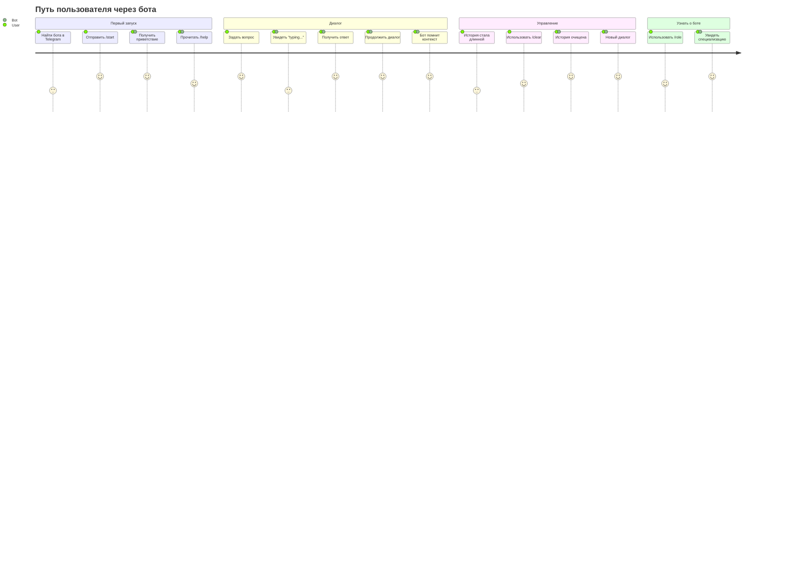

---

## 13. 🔄 Error Handling Flow

### Обработка ошибок LLM API

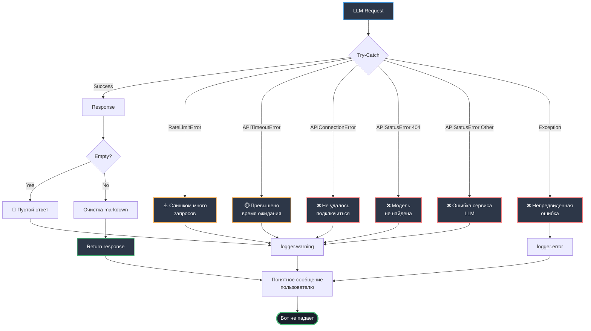

---

## Итого

Этот гайд покрывает проект с **13 различных перспектив**:

1. ✅ Системная архитектура (layers)
2. ✅ Поток обработки сообщений (sequence)
3. ✅ Структура проекта (tree + dependencies)
4. ✅ Жизненный цикл контекста (state machine)
5. ✅ Модель данных (class diagram)
6. ✅ Developer workflow (flowchart + TDD)
7. ✅ Маршрутизация команд/сообщений
8. ✅ Тестовая архитектура
9. ✅ Конфигурация и секреты
10. ✅ Deployment view
11. ✅ Quality checks pipeline
12. ✅ User journey
13. ✅ Error handling flow

**Все диаграммы используют контрастные цвета для читаемости в dark theme.**

---

## Как просматривать

- **VS Code/Cursor:** Установите "Markdown Preview Mermaid Support" → `Ctrl+Shift+V`
- **GitHub:** Диаграммы рендерятся автоматически
- **Online:** [mermaid.live](https://mermaid.live/)

---

**Версия:** 1.0
**Дата:** 2025-10-16

